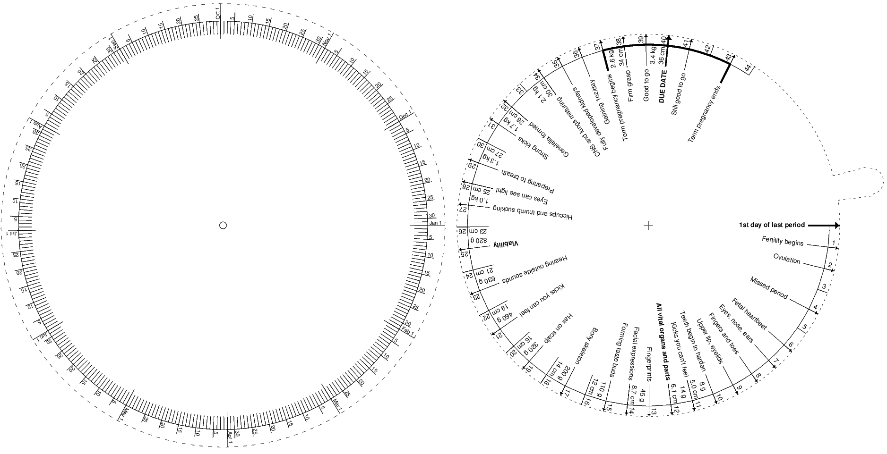

# Pregnancy Wheels

This repository contains print-at-home pregnancy wheels. To assemble them,
cut them out, then with a craft knife cut out the center circle of one wheel
and the center slit of the other one. Put a brass fastener through the slits
and you're done.

To use it, rotate the top wheel until the bold "due date" arrow is pointing
to your due date. Then the rest of the arrows will point to various milestones.

This document is hand-written PostScript. If you open it in a text editor, it
should be fairly intuitive how to edit it to change the set of milestones, or
even to modify it for non-pregnancy purposes (such as remembering when to change
your water filters, say).

